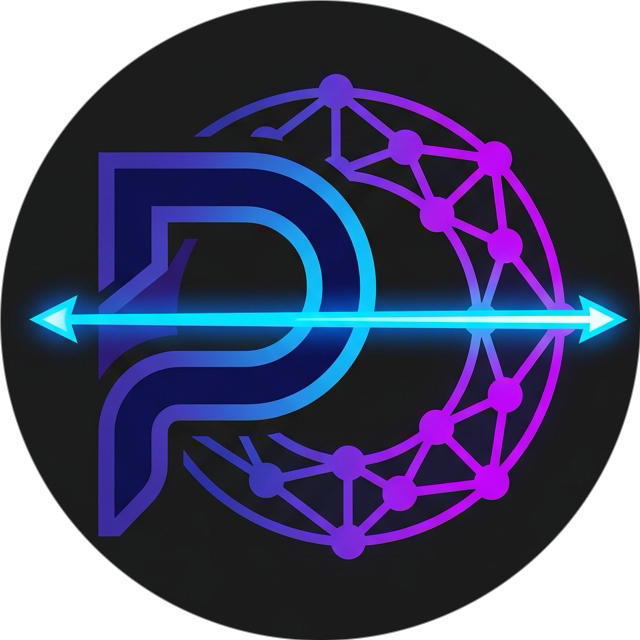

<p align="center">
  
</p>

<h1 align="center">PaddleOcrNet</h1>

<p align="center">
  <strong>The complete PaddleOCR document pipeline — natively in .NET, on ONNX Runtime.</strong><br/>
  Turn scans, photos, and PDFs into text, tables, formulas — and answers.<br/>
  <em>No Python. No native PaddlePaddle. No sidecar server. Just a NuGet package.</em>
</p>

<p align="center">
  <a href="https://www.nuget.org/packages/PaddleOcrNet"></a>
  <a href="https://www.nuget.org/packages/PaddleOcrNet"></a>
  
  
  
  
  <a href="LICENSE"></a>
</p>

---

PaddleOcrNet turns scanned documents, photos, and PDFs into structured text — and into answers. It runs the
full **PP-OCRv5 + PP-StructureV3** pipeline — text detection, recognition, orientation correction, layout
analysis, table extraction, and formula recognition — entirely in managed .NET on
[ONNX Runtime](https://onnxruntime.ai/), then layers on **LLM-backed key-information extraction and document
Q&A** through any provider you choose. Models download and cache on first use; everything after that runs
in-process, offline-capable, and trim/AOT-friendly.

## Highlights

- **High-accuracy text OCR** — DB detection + SVTR recognition (PP-OCRv5) handles dense invoices, forms,
  receipts, handwriting, rotated scans, and curved text.
- **80+ languages** across 12 script families, with one shared detector and per-script recognizer packs.
- **Automatic language detection** — pass `OcrLanguage.Auto` and PaddleOcrNet identifies the script and
  pulls the right model on demand (Python PaddleOCR requires you to name the language up front).
- **Document understanding** — `AnalyzeDocumentAsync` returns layout regions, reading order, tables as
  HTML, and formulas as LaTeX, and serializes the whole document to **Markdown, HTML, JSON, Word, or Excel**.
- **Ask your documents** — LLM-backed key-information extraction, Q&A, and **chart-to-data** parsing,
  provider-agnostic: bring your own `IChatModel` or use the built-in OpenAI-compatible adapter (OpenAI,
  Azure, Ollama, vLLM, Groq, …). Charts are reconstructed to Markdown tables via a vision model — no local GPU.
  Or extract labeled fields **offline** with the heuristic, layout-based KIE extractor — no LLM, no network.
- **PDF in, searchable PDF out** — rasterize and OCR PDFs, or emit a searchable PDF with an invisible
  text layer.
- **Robust by design** — singleton-safe, thread-safe ONNX sessions; DI + health checks; OpenTelemetry
  metrics; typed exceptions; input/decompression-bomb guards; checksum-verified model downloads.
- **Deploys anywhere** — pure-managed (no OpenCV), CPU by default, optional CUDA, **Native AOT** and
  single-file publish supported. Mobile models are a few MB each.

---

## Installation

```bash
dotnet add package PaddleOcrNet

# Optional — NVIDIA CUDA 12+ acceleration (used automatically when present):
dotnet add package PaddleOcrNet.Gpu
```

Requires **.NET 10** (`net10.0`). Windows, Linux, and macOS (x64/arm64).

---

## Quick start

```csharp
using PaddleOcrNet.Models;
using PaddleOcrNet.Services;

// ONNX models download + cache on first use; construction itself loads nothing.
await using var ocr = new PaddleOcrService();

OcrResult result = await ocr.ExtractTextFromImage("invoice.png", OcrLanguage.English);

Console.WriteLine(result.FullText);
foreach (var line in result.Lines)
    Console.WriteLine($"[{line.Confidence:F2}] {line.Text}");
```

Input can be a file path, `byte[]`, `Stream`, or an already-decoded `Image<Rgb24>`:

```csharp
await ocr.ExtractTextFromImage(bytes,  OcrLanguage.English);
await ocr.ExtractTextFromImage(stream, new[] { OcrLanguage.English, OcrLanguage.German });

// Detect-only (bounding boxes for redaction / cropping — no recognition):
var regions = await ocr.DetectRegionsAsync("page.png");

// Recognize caller-supplied regions (skip detection):
var partial = await ocr.RecognizeRegionsAsync(image, regions, new[] { OcrLanguage.English });
```

### Automatic language detection

```csharp
// OcrLanguage.Auto → PaddleOcrNet detects the dominant script, downloads the matching pack, and reports it.
OcrResult r = await ocr.ExtractTextFromImage("multilingual.png", OcrLanguage.Auto);

Console.WriteLine(string.Join(", ", r.DetectedLanguages)); // e.g. "arabic, latin, ch"
```

---

## Document structure analysis

`AnalyzeDocumentAsync` runs the PP-StructureV3 pipeline — orientation → layout detection → per-region
OCR / table / formula → reading-order reconstruction — and returns a structured document you can export
straight to Markdown or JSON.

```csharp
using PaddleOcrNet.Models;
using PaddleOcrNet.Services;
using PaddleOcrNet.Structure;

await using var ocr = new PaddleOcrService();

StructureResult doc = await ocr.AnalyzeDocumentAsync("report.png", new StructureOptions
{
    Languages         = new[] { OcrLanguage.English },
    UseDocOrientation = true,    // auto-rotate skewed scans (0/90/180/270°)
    RecognizeTables   = true,    // tables → HTML
    RecognizeFormulas = true,    // formulas → LaTeX
});

foreach (var block in doc.Blocks)
    Console.WriteLine($"#{block.Order} {block.Type} — {block.Text}");

string markdown = doc.ToMarkdown();  // titles, paragraphs, tables (HTML), formulas ($$…$$)
string json     = doc.ToJson();      // structured blocks with bounding boxes + reading order
```

| Stage | Model | Output |
| --- | --- | --- |
| Layout analysis | PP-DocLayoutV3 (RT-DETR) | region boxes + 25 block types |
| Table recognition | SLANet_plus (default) · SLANeXt v2 | `<table>` HTML with cell text matched into the grid |
| Formula recognition | LaTeX-OCR | LaTeX string |
| Orientation / unwarp | PP-LCNet · UVDoc | de-skewed, de-warped page |
| Reading order | XY-cut | multi-column document order |

For tables, set `StructureOptions.TableModel = TableRecognitionModel.SlaNeXt` to use the PP-StructureV3 **v2**
path: a `PP-LCNet` classifier decides wired (bordered) vs wireless (borderless) and runs the matching
**SLANeXt** model — often more accurate on clearly bordered/borderless tables (downloads three small models on
first use). The default, `SlanetPlus`, is a single end-to-end model.

### Exports with embedded figures & native equations

The DOCX and HTML exporters take an optional image overload — pass the **same** image you analyzed and
figure / chart / seal regions are cropped and embedded as **real pixels** (DOCX gets an inline `word/media/`
image part; HTML gets a `data:image/png;base64,…` ``). The no-image overloads keep their bbox-placeholder
behavior. The image-aware DOCX path also renders recovered formula LaTeX as **native Word equations (OMML)**
via a best-effort LaTeX→OMML converter (`PaddleOcrNet.Structure.Export.LatexToOmml`) — fractions,
sub/superscripts, roots, Greek letters, n-ary sum/integral/product, and common operators; unsupported
constructs degrade gracefully to text.

```csharp
using PaddleOcrNet.Structure.Export;

StructureResult doc = await ocr.AnalyzeDocumentAsync("report.png");
using var page = EasyImageSharp.Image.Load<EasyImageSharp.PixelFormats.Rgb24>("report.png");

byte[] docx = doc.ToDocx(page);          // figures/charts/seals as inline images; formulas as OMML equations
string html = doc.ToHtml(page, "Report"); // figures/charts/seals as inline 
```

---

## Supported languages

A single **DB detector** serves every language; recognition selects a per-script **recognizer pack**
(PP-OCRv5 mobile + the matching character dictionary). Languages are expressed with the **`OcrLanguage`**
enum; each value maps to one of the representative recognizer codes below:

| Pack | Codes |
| --- | --- |
| Chinese / English / Japanese (default) | `ch` `zh` `en` `ja` |
| Latin | `latin` `fr` `de` `es` `it` `pt` `nl` `pl` `tr` `vi` … |
| Cyrillic | `cyrillic` `ru` `uk` `bg` `sr` `be` `mn` … |
| Arabic | `arabic` `ar` `fa` `ur` `ug` |
| Devanagari | `devanagari` `hi` `mr` `ne` `sa` … |
| Korean | `korean` `ko` |
| Japanese (full) | `japan` |
| Thai · Greek · Telugu · Tamil | `thai`/`th` · `greek`/`el` · `telugu`/`te` · `tamil`/`ta` |
| Traditional Chinese | `chinese_cht` `cht` `zh_tra` |
| East-Slavic | `eslav` `ru_eslav` `uk_eslav` `be_eslav` |

Or pass **`OcrLanguage.Auto`** to detect the script automatically.

Languages are **enum-only** — the OCR methods take `OcrLanguage` (there are no raw-string overloads). The
single-language overload defaults to `OcrLanguage.Auto`, so `ExtractTextFromImage("x.png")` auto-detects
with zero configuration:

```csharp
using PaddleOcrNet.Models;

await ocr.ExtractTextFromImage("page.png");                                       // zero-config: defaults to OcrLanguage.Auto
await ocr.ExtractTextFromImage("page.png", OcrLanguage.French);                   // single language
await ocr.ExtractTextFromImage("page.png", new[] { OcrLanguage.English, OcrLanguage.German });  // multiple
await ocr.ExtractTextFromImage("page.png", OcrLanguage.Auto);                     // explicit auto-detect

// Got raw codes from config or the command line? Parse them into the enum:
OcrLanguage lang = OcrLanguageExtensions.FromCode("en");
IReadOnlyList<OcrLanguage> langs = OcrLanguageExtensions.FromCodes(new[] { "en", "de" });
```

---

## ASP.NET Core / dependency injection

```csharp
using PaddleOcrNet.Models;

builder.Services.AddPaddleOcrNet(o =>
{
    o.UseTextLineOrientation = true;       // correct 180°-flipped lines
    o.ModelCachePath         = "/var/cache/ocr";
});

// Readiness probe — Healthy once models for these languages are cached:
builder.Services.AddHealthChecks()
    .AddPaddleOcrHealthCheck(languages: new[] { OcrLanguage.English, OcrLanguage.ChineseSimplified });
```

`IPaddleOcrService` is registered as a **singleton** — ONNX sessions are expensive to build and safe to
share across threads. Call `WarmUp(...)` to pre-load models off the request path.

---

## Configuration

| Concern | How |
| --- | --- |
| **GPU** | Add `PaddleOcrNet.Gpu`; CUDA 12+ is detected and used automatically, otherwise CPU. |
| **Model cache** | `%LOCALAPPDATA%` / `~/.local/share` by default; override via `ModelCachePath` or `PADDLEOCRNET_CACHE`. |
| **Model host** | Defaults to the public Hugging Face repo; point at a private mirror via `PADDLEOCRNET_MODEL_BASE_URL` or `ModelDownloadOptions.BaseUrlOverride`. |
| **Offline / air-gapped** | Pre-seed the cache (or a mirror) and run fully offline; downloads are SHA-256 verified. |
| **Throughput** | `BatchSize`, `MaxDegreeOfParallelism`, and reading-order / paragraph grouping via `RecognitionOptions`. |
| **Input limits** | Built-in max-pixel / PDF page guards against decompression bombs. |

### Output formats

`OcrResult` exports to plain text, **JSON**, **hOCR**, **ALTO XML**, and TSV; documents export to
**Markdown**, **HTML**, **JSON**, **Word (.docx)**, and **Excel (.xlsx)** (with native tables / merged
cells). The `ToDocx(image)` / `ToHtml(image)` overloads embed figure/chart/seal regions as **real pixels**,
and DOCX formulas render as **native Word equations (OMML)**. Multi-page Markdown can be stitched with
`ConcatenateMarkdownPages`; PDFs can be re-emitted as **searchable PDFs**. All exporters are AOT-safe via a
source-generated JSON context.

---

## Document intelligence (LLM-backed KIE & Q&A)

The `PaddleOcrNet.Intelligence` layer adds key-information extraction and document Q&A on top of OCR/structure
analysis — **provider-agnostic**. Plug in any LLM by implementing `IChatModel`, or use the built-in
OpenAI-compatible adapter, which targets OpenAI, Azure OpenAI, Ollama, vLLM, LM Studio, Groq, Together,
DeepSeek, Mistral, and any other OpenAI-style `/chat/completions` endpoint.

```csharp
using PaddleOcrNet.Intelligence;

// Pick any provider — here OpenAI; swap for .AzureOpenAi(...), .Ollama(...), or .Generic(...).
var chat = new OpenAiCompatibleChatModel(OpenAiCompatibleOptions.OpenAi(apiKey, "gpt-4o-mini"));
var docs = new DocumentIntelligenceEngine(ocrService, chat);

// Key-information extraction (returns a JSON-grounded key → value result).
var info = await docs.ExtractKeyInformationAsync("invoice.png", new[] { "Invoice Number", "Vendor", "Total" });
Console.WriteLine(info["Total"]);

// Document question-answering.
var answer = await docs.AskAsync("contract.pdf", "What is the termination notice period?");
Console.WriteLine(answer.Answer);
```

DI: `services.AddOpenAiCompatibleChatModel(...)` (or `AddChatModel(myModel)`) + `AddPaddleOcrDocumentIntelligence()`.
The model is grounded on the parsed document Markdown by default; set `DocumentIntelligenceOptions.UseVision`
to also attach the page image when the model is multimodal.

### Chart → data (vision-LLM, PP-Chart2Table equivalent)

`ParseChartsAsync` detects chart/plot regions in a document and reconstructs the data behind each one as a
GitHub-flavored Markdown table — the provider-agnostic equivalent of PaddleOCR's PP-Chart2Table. It crops
each detected chart region and sends **only those pixels** to a **vision-capable** model, so it works with
any vision provider (OpenAI `gpt-4o`, Azure, or a local Ollama `qwen2.5-vl` / `llama3.2-vision`) and needs
**no local GPU** — the provider performs the vision inference.

```csharp
using PaddleOcrNet.Intelligence;

// Reconstruct the data behind every chart in a document (needs a vision-capable model).
ChartParseResult charts = await docs.ParseChartsAsync("report.png");
foreach (ParsedChart chart in charts.Charts)
{
    Console.WriteLine($"{chart.ChartType}: {chart.Title}");
    Console.WriteLine(chart.DataMarkdown);   // a Markdown table of the chart's data
}
```

With the built-in `OpenAiCompatibleChatModel`, vision is on by default
(`OpenAiCompatibleOptions.SupportsVision` defaults to `true`); if the configured model isn't vision-capable
and the document has charts, the call throws `NotSupportedException`. Customize the extraction prompt via
`DocumentIntelligenceOptions.ChartExtractionSystemPromptOverride`. This is the vision-LLM path — there is no
bundled offline chart ONNX model.

### Offline (non-LLM) KIE

`IOfflineKeyInformationExtractor` is the **offline alternative** to LLM-backed `ExtractKeyInformationAsync` —
use it when you can't or don't want to call a model. It's a heuristic, geometry-based extractor (no LLM, no
network, CPU-only): for each key it finds the label in the OCR text and reads the value inline (`Key: value`),
to the right (same row), or below. It returns the same `KeyInformationResult` (with `Usage` / `Model` /
`RawJson` left `null`). Best-effort — it works best on clearly labeled forms and invoices.

```csharp
using PaddleOcrNet.Intelligence.Offline;

var extractor = new OfflineKeyInformationExtractor(ocrService);

OcrResult ocr = await ocrService.ExtractTextFromImage("invoice.png");
KeyInformationResult result = extractor.Extract(ocr, new[] { "Invoice Number", "Total" });
Console.WriteLine(result["Total"]);

// Or OCR + extract in one call (uses OcrLanguage.Auto):
result = await extractor.ExtractAsync("invoice.png", new[] { "Invoice Number", "Total" });
```

DI: `services.AddPaddleOcrOfflineKie();` (requires `AddPaddleOcrNet()`), then inject
`IOfflineKeyInformationExtractor`.

---

## Models & licensing

PaddleOcrNet ships **no weights** — on first use it downloads PP-OCRv5 / PP-StructureV3 ONNX models and
their dictionaries (SHA-256 verified) to the local cache. The models are derived from
[PaddleOCR](https://github.com/PaddlePaddle/PaddleOCR) (**Apache-2.0**, © PaddlePaddle/Baidu); the formula
model is [RapidLaTeXOCR](https://github.com/RapidAI/RapidLaTeXOCR) (**MIT**). See [NOTICE](NOTICE) for
attribution. The library itself is **MIT** — see [LICENSE](LICENSE).

> **Note on formula recognition:** PaddleOCR's PP-FormulaNet cannot be exported to ONNX, so PaddleOcrNet
> uses the equivalent LaTeX-OCR model for formula → LaTeX.

---

## Roadmap

Already shipped: detection, recognition (multilingual + auto-detect), orientation, unwarp, layout, tables,
formulas, reading order, Markdown/HTML/JSON/DOCX/XLSX export (with embedded figure/chart/seal pixels and
native Word equations via OMML), the PDF pipeline, LLM-backed document intelligence (key-information
extraction, Q&A, and chart-to-data parsing — the PP-Chart2Table-equivalent vision-LLM path), and a
heuristic, layout-based **offline KIE** extractor as the non-LLM alternative. Under consideration:

- Optional RT-DETR table-cell detector path for table recognition (SLANeXt already recovers cells from its
  own location head, so this is an accuracy enhancement rather than a gap)
- A model-based on-device (ONNX VI-LayoutXLM) KIE path to complement the current heuristic offline extractor
- PP-OCRv6 model line
- Additional per-language recognizer packs

---

## Why PaddleOcrNet?

- **vs. Python PaddleOCR** — same models and accuracy, but no Python runtime, no `paddlepaddle` native
  dependency, and no server process. Ships as a single NuGet package with first-class .NET ergonomics
  (DI, health checks, AOT) and adds automatic language detection.
- **vs. cloud OCR APIs** — runs entirely in-process and offline; no per-page fees, no data leaving your
  infrastructure.
- **vs. EasyOCR-based libraries** — PP-OCRv5 is materially stronger on dense documents, tables, rotated
  scans, handwriting, and CJK, and adds full document-structure understanding.

---

## Contact

For work inquiries, collaboration, feature requests, or any questions, reach out to:

**Farhan Lodi** — [farhanlodi31@gmail.com](mailto:farhanlodi31@gmail.com)

---

## License

MIT © PaddleOcrNet contributors. Downloaded models are Apache-2.0 / MIT and attributed to their authors
(see [NOTICE](NOTICE)).

Every runtime dependency is permissively licensed, with no revenue threshold, commercial tier or licence
key anywhere in the stack: imaging runs on [EasyImageSharp](https://github.com/FarhanLodi/EasyImageSharp)
(MIT), inference on ONNX Runtime (MIT), PDF rasterization on Docnet.Core (MIT) and polygon offsetting on
Clipper2 (BSL-1.0).
